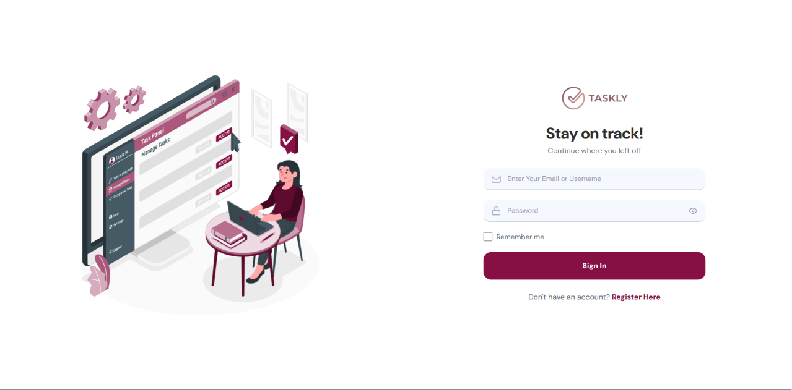

<p align="center">
  
  
</p>

<h1 align="center">Taskly</h1>

<p align="center">
  <b>A modern, collaborative task management web application.</b><br/>
  Built with Laravel, Inertia.js, and React — designed for individuals and teams.
</p>

<p align="center">
  
  
  
  
  
  
</p>

---

## 📖 About

**Taskly** is a full-stack task management application that helps users organize their personal tasks and collaborate with others in real time. Taskly offers a clean, responsive interface with a premium design — featuring dark-accented aesthetics, micro-animations, and intuitive workflows.

---

## ✨ Features

### 🗂️ Task Management
- **Create, edit, delete** tasks with title, description, priority, status, deadline, and category
- **Three priority levels** — Low, Medium, High — each visually distinguished by color-coded badges
- **Three statuses** — Not Started, In Progress, Completed — with inline status switching directly from the task preview panel
- **Deadline tracking** — displays countdowns (e.g., "in 2d") and overdue warnings
- **Filter & search** tasks by status, priority, or keyword in real time

### ⭐ Vital Tasks
- Mark tasks as **Vital** to pin them in a dedicated high-priority view
- Vital tasks are visually highlighted with a fire 🔥 badge and a red border accent

### 🗃️ Task Categories
- Create color-coded categories to group and organize tasks
- Choose from a palette of preset colors or pick a custom one

### 🤝 Collab Tasks *(Collaborative)*
- Each task has a unique **invite code**
- Share the code with teammates to invite them to join a task
- Task author receives a **notification** with Accept / Decline controls
- Collab tasks are marked with a 👥 group icon on the card

### 🔔 Notifications
- In-app notification **popover** accessible from the navbar
- Polls every 15 seconds for new join requests (lightweight, no WebSockets required)
- Notifications are auto-marked as read when the popover is opened

### 📊 Dashboard
- Overview of total tasks, completed count, in-progress, and vital tasks
- Visual progress indicator and recent activity

### 👤 Profile Management
- Update name, email, contact, position/role
- Upload a **profile photo** 

### 🔐 Authentication
- Register / Login / Forgot Password / Reset Password
- Fully custom-styled auth pages matching the Taskly design system
- Password visibility toggle on all password inputs

---

## 🛠️ Tech Stack

| Layer | Technology |
|---|---|
| **Backend** | [Laravel 10](https://laravel.com/) (PHP 8.1+) |
| **Frontend** | [React 18](https://react.dev/) + [Inertia.js](https://inertiajs.com/) |
| **Styling** | [Tailwind CSS v4](https://tailwindcss.com/) |
| **Build Tool** | [Vite 5](https://vitejs.dev/) |
| **Database** | MySQL (with SQLite support for local dev) |
| **Auth** | Laravel Breeze (custom UI) |
| **Routing** | Ziggy (Laravel routes in JS) |
| **Typography** | [Geist Variable](https://vercel.com/font) |
| **UI Primitives** | Base UI, Headless UI |

---

## 🚀 Getting Started


### Installation

**1. Clone the repository**
```bash
git clone https://github.com/dvsalmah/taskly-app.git
cd taskly-app
```

**2. Install PHP dependencies**
```bash
composer install
```

**3. Install Node dependencies**
```bash
npm install
```

**4. Set up environment**
```bash
cp .env.example .env
php artisan key:generate
```

**5. Configure your database**

Edit `.env` and set your database credentials:
```env
DB_CONNECTION=mysql
DB_HOST=127.0.0.1
DB_PORT=3306
DB_DATABASE=taskly
DB_USERNAME=root
DB_PASSWORD=
```

**6. Run migrations**
```bash
php artisan migrate
```

**7. Link storage (for photo uploads)**
```bash
php artisan storage:link
```

---

### Running Locally

Open **two terminals** simultaneously:

```bash
# Terminal 1 — Laravel backend
php artisan serve

# Terminal 2 — Vite frontend (hot reload)
npm run dev
```

The app will be available at **http://localhost:8000**

---

### Production Build

```bash
npm run build
php artisan serve
```

---

## 📁 Project Structure

```text
├── app/
│   ├── Http/Controllers/    # Laravel controllers
│   ├── Models/              # Eloquent models
│   └── Providers/           # Service providers
├── database/
│   └── migrations/          # Database schema
├── resources/
│   ├── js/
│   │   ├── components/      # React components (Shared, UI, Sidebar, Navbar)
│   │   ├── constants/       # Global constants
│   │   ├── hooks/           # Custom React hooks
│   │   ├── Layouts/         # Layout components (AuthenticatedLayout, GuestLayout)
│   │   ├── lib/             # Utility functions
│   │   └── Pages/           # Page components (Dashboard, MyTask, Profile, Auth)
│   └── css/                 # Global styles
└── routes/
    ├── web.php              # Web routes
    └── auth.php             # Authentication routes
```

---

## 🗄️ Database Schema

```
users               — id, username, first_name, last_name, email, contact, position, photo, password
categories          — id, user_id, name, color
tasks               — id, user_id, username, category_id, title, description, priority, status, deadline, referral_code, is_vital
task_collaborators  — task_id, user_id  (pivot)
task_invitations    — id, task_id, requester_id, status (pending|accepted|declined), read
```

---


## 📄 License

This project is open-sourced under the [MIT License](LICENSE).

---
